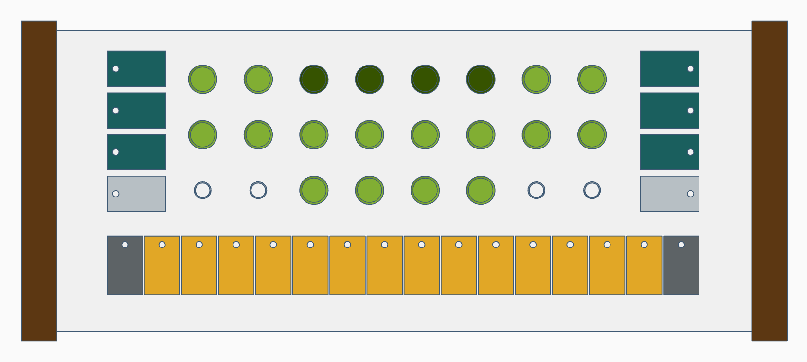

#   The DIY MIDI Sequencer and Ableton surface project

The original idea behind this project is to create a DIY fully Open Source version of the ableton Push in a smaller but equally functional form factor. Then the idea changed to a midi sequencer with modulation sequencing. And finally it became this project, which is a fusion of both, priorizing the sequencer over the control surface, but still having one with a lot of control.

The controller will be based on a Raspberry Pi Pico.

##  To do:

- [x] Search for documentation.
- [x] Controller design and functionality.
    - [x] Design.
    - [x] Push button design.
    - [ ] Pot cap design.
    - [x] Functionality table.
- [ ] Everything else xD.